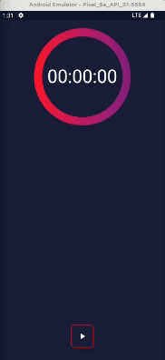
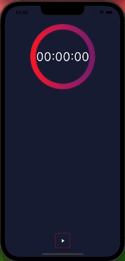
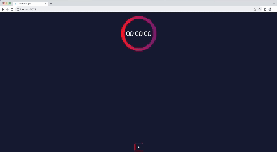
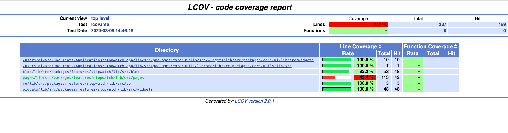

# Stopwatch App

This is a simple stopwatch application built with Flutter and Bloc that allows users to track time and optionally record laps.

## Features
- **Start Stopwatch:** Users can start the stopwatch to begin tracking time.
- **Stop Stopwatch:** Users can stop the stopwatch to end tracking time.
- **Track Laps: Users** have the option to track laps while the stopwatch is running.
- **Order of Laps:** Laps are recorded in the order they are tracked.
- **Number of Laps:** Users can see how many laps have been recorded.
- **Reset Stopwatch:** Users can reset the stopwatch, which resets all laps and overall time.

## Screenshots
<p>
     
     
    
</p>

<p>
     
</p>

## Running the example code

This sample requires Flutter 3.16

## Getting Started

1. Clone the repository

```
git clone https://github.com/alvaroarmijos/stopwatch_app.git
```

2. Navigate into the project directory:

```
cd stopwatch_app
```

3. Run the app:

```
flutter run
```


## Running Tests

The test coverage of this application is 70%.

<p>
     
</p>

All you have to do is to run these three commands:

```
# Generate `coverage/lcov.info` file
flutter test --coverage
#Remove res files from coverage
lcov --remove coverage/lcov.info "**/res/" -o coverage/lcov.info
# Generate HTML report
# Note: on macOS you need to have lcov installed on your system (`brew install lcov`) to use this:
genhtml coverage/lcov.info -o coverage/html
# Open the report
open coverage/html/index.html
```